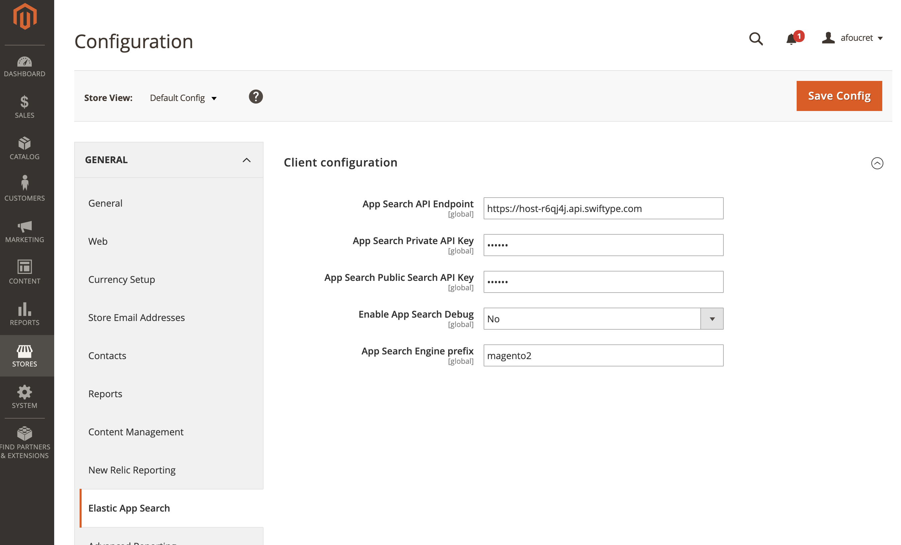
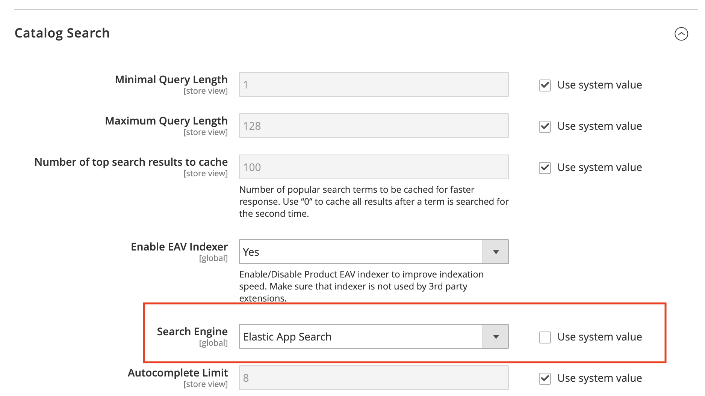

<p align="center"></p>

<p align="center">
  
  <a href="https://github.com/elastic/app-search-magento/releases"></a>
  <a href="https://circleci.com/gh/elastic/app-search-magento"></a>
</p>

> A first-party Magento integration for building excellent, relevant search experiences with [Elastic App Search](https://www.elastic.co/cloud/app-search-service).

> **:warning: This is a beta version of the client. [View known issues](#known-issues).**


## Contents

- [Getting started](#getting-started-)
- [Usage](#usage)
- [Development](#development)
- [FAQ](#faq-)
- [Contribute](#contribute-)
- [License](#license-)

***

## Getting started 🐣

Using this client assumes that you have already:

- Created an App Search account on https://swiftype.com/ or you have a self managed version of App Search available

- Magento >= 2.2.x installed and running

You can install the module in your project by using this composer command from your Magento project root:

```bash
composer require elastic/app-search-magento:1.0.0-beta1@beta
```

## Usage

### Configuring App Search credentials

To configure your credentials, you will need to collect the following information:

- Your App Search API endpoint
- Your App Search Private API key
- Your App Search Public Search key

If using a swiftype.com account, you will be able to access this information at [https://app.swiftype.com/as/credentials](https://app.swiftype.com/as/credentials).

Self-managed users should connect to their App Search instance to retrieve their credentials.

#### From Magento Admin

You can provide your App Search credentials within Magento Admin by browsing to the **Stores > Configuration > General > Elastic App Search** section:



**Note:**
The module will create one App Search Engine per store view.
New Engines will use a prefix that can be configured within the client: e.g. `magento2-catalogfulltext-search-1`.

Update this setting (e.g. `my-website-staging`) if you plan to use the same account for several environment.

#### From Magento CLI

You can update credentials using the Magento CLI:

```bash
bin/magento config:set elastic_appsearch/client/api_endpoint "https://host-xxxx.api.swiftype.com"
bin/magento config:set elastic_appsearch/client/private_api_key "private-XXXXX"
bin/magento config:set elastic_appsearch/client/search_api_key "search-XXXXX"
```

You can additionally set the Engine prefix:

```bash
bin/magento config:set elastic_appsearch/client/engine_prefix "my-website-staging"
```

### Configuring App Search as Magento default search engine

Once your credentials are set in Magento, you need to update Magento configuration to use App Search instead of the out of the box MySQL search engine.

Browse to the **Stores > Configuration > Catalog > Catalog Search** section to do so:



As an alternative, you can use the Magento CLI to change the default search engine:

```bash
bin/magento config:set catalog/search/engine "elastic_appsearch"
```

### Reindexing content

To finish the install, you need to clean your cache and reindex your content into App Search:

```bash
bin/magento cache:clean
bin/magento indexer:reindex catalogsearch_fulltext
```

### Known issues

The module is in its first round of beta. This first round is intended to act as a technical preview, which aims to integrate App Search as a Magento search adapter interface.

There are a few caveats with the current implementation:

- The maximum number of fields allowed by App Search (currently 64) does not allow you to index catalogs with too many products attributes (#37)

- We will need to rework how product prices are stored into App Search to allow sites with a large number of customer groups to be indexed (#38)

- Search relevance is still being tuned.


## Development

We ❤️ developers and want everyone to be able to contribute to the module.

We have built a fully dockerized development environment using Magento sample data to help you in testing the module and contributing to the code.

Full documentation to setup your environment is available [here](docs/DEVELOPMENT-ENVIRONMENT.md).

## FAQ 🔮

### Where do I report issues with the client?

If something is not working as expected, please open an [issue](https://github.com/elastic/app-search-magento/issues/new).

### Where can I find the full App Search API documentation ?

Your best bet is to read the [documentation](https://swiftype.com/documentation/app-search).

### Where else can I go to get help?

You can checkout the [Elastic community discuss forums](https://discuss.elastic.co/c/app-search).

## Contribute 🚀

We welcome contributors to the project. Before you begin, a couple notes...

+ Before opening a pull request, please create an issue to [discuss the scope of your proposal](https://github.com/elastic/app-search-magento/issues).
+ Please write simple code and concise documentation, when appropriate.

## License 📗

[Open Software License ("OSL") v.3.0](LICENSE) © [Elastic](https://github.com/elastic)

Thank you to all the [contributors](https://github.com/elastic/app-search-magento/graphs/contributors)!
